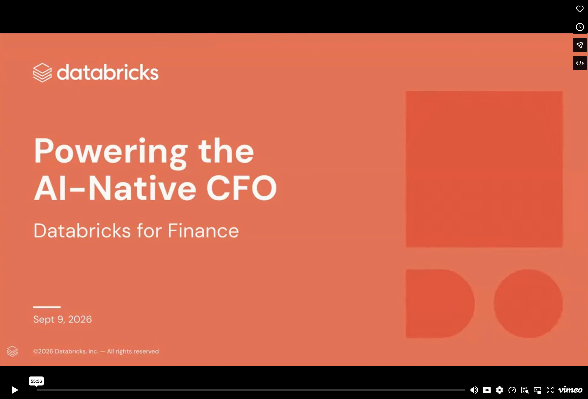

# Meridian AI Cockpit

A Databricks App that shows how a CFO's team can explore governed data in plain English
with Databricks AI/BI Genie, and track AI spend alongside the rest of the P&L. It's built
around a fictional digital banking group, Meridian Bank, and its two recently acquired
subsidiaries.

> **Demo / synthetic data.** The company names, organizational structure, transactions,
> and every figure in this repository are synthetic demo content generated by the setup
> notebook. They do not describe any Databricks customer or other real organization.
> Any resemblance to an existing company or trademark is coincidental; no affiliation
> or endorsement is intended.

## The story this demo tells

Meridian Bank is a digital banking group with three entities:

| Entity | Geography | Role in the story |
|--------|-----------|-------------------|
| **Meridian Bank** | US | The profitable parent. Healthy margins, strong cash. |
| **Northcrest Financial** | Canada | A clean, margin-accretive acquisition. The "good" subsidiary. |
| **Coral Pay** | Australia | The problem child: high growth but burning cash, roughly 10 months of runway. |

At the group level everything looks great. ARR and revenue are growing strongly, gross
margin is healthy, and group free cash flow is positive. But one entity is quietly
draining it.

Here's the part a CFO cares about: Coral Pay is losing money in two places at once, and
the two problems rhyme.

1. **Cash.** It's burning about $14M a month and consuming nearly all of the group's free cash flow.
2. **AI.** It's running well over its AI budget, with about two-thirds of its AI spend on a
   single premium model provider. Its data science team leans on a frontier model for work
   a cheaper model could do.

The same lack of discipline shows up in the financials and in the AI spend. Genie is what
lets a CFO see both at once and act: one natural-language assistant over the whole
business, finance and AI cost together, grounded in governed Unity Catalog data, with the
SQL shown for every answer.

The point of the demo is to show how a CFO gets to the root cause of the Coral Pay problem.
You start from a group-level symptom ("free cash flow is thin"), drill through the numbers
with Genie, and land on the specific drivers you can act on: the cash burn and the
concentrated, over-budget AI spend. It turns a vague "something's off" into a concrete,
evidence-backed plan in minutes instead of a reconciliation cycle.

## Run the demo (about 5 minutes)

Present the three tabs left to right. The story builds as you go.

**1. Group Perf: "everything looks fine, mostly."**
Open on the KPI row: ARR, gross margin, and revenue all look healthy. Then point to the
**AI Insights** panel, a Genie/Claude-generated executive summary that has already read the
group's numbers and flagged **Coral Pay** as the risk. Scroll to the **EBITDA by entity**
chart: Meridian and Northcrest are green, Coral Pay is deep red.
*Takeaway: the group is growing, but one entity is bleeding.*

**2. AI Spend: "and it's bleeding on AI too."**
The KPI row shows group AI spend, AI as a percent of revenue, budget utilization, and the
frontier vs open-weight mix. Then the three points that land:
- **AI as % of revenue by entity.** Every entity is under about 1 percent, except Coral Pay, which towers over the rest.
- **AI spend vs budget.** Two entities sit under plan (indigo); Coral Pay is well over (red).
- **Provider concentration.** Coral Pay is flagged HIGH: most of its spend rides on a single provider.

*Takeaway: the entity burning cash is also the one with undisciplined, concentrated AI spend, and that's a lever you can pull this quarter.*

**3. CFO Q&A: "let Genie connect the dots."**
This is the hero moment. Use the suggested questions to drill from symptom to root cause,
in plain English, live:
1. *"Which entity is dragging down group free cash flow?"* returns Coral Pay
2. *"Why is Coral Pay burning cash?"* returns the margin and EBITDA breakdown
3. *"Which entities are over their AI budget, and by how much?"* returns Coral Pay, well over
4. *"How much of Coral Pay's AI spend is on a single provider?"* returns the concentration risk
5. *"What's our group AI spend as a % of revenue, and is it growing?"* returns the trend

Each answer shows the generated SQL and a chart or table, so it's clearly grounded rather
than made up. Then click **Open in Genie One** to take the same assistant into the full
Genie One experience and draft a board-ready action plan from the conversation.

> **Tip:** frame any "what should we do?" prompt constructively, for example: *"draft a plan
> to bring Coral Pay's AI spend under control via smart routing and provider diversification."*

## The app (3 tabs)

| Tab | What it shows |
|-----|---------------|
| **Group Perf** | Group KPIs, a revenue-bridge breakdown and financial summary, ARR and margin trends, EBITDA-by-entity and geography charts, and an AI-generated executive summary grounded in the real numbers. |
| **AI Spend** | AI cost by entity, provider, team, and model; budget utilization; AI as a percent of revenue; frontier vs open-weight mix; and single-provider concentration risk. |
| **CFO Q&A** | Natural-language questions answered by a Databricks Genie space over the Unity Catalog tables (with visible SQL), plus an **Open in Genie One** launchpad for the full assistant experience. |

## Screenshots


## Architecture

```
FastAPI (app.py)
  /api/kpis, /api/trends, /api/summary, ...  ->  server/data_routes.py       ->  SQL Warehouse
  /api/ai/overview, /api/ai/providers, ...   ->  server/ai_routes.py         ->  SQL Warehouse
  /api/genie/ask                             ->  server/genie_routes.py      ->  Genie Space API
  /api/synthesis                             ->  server/synthesis_routes.py  ->  Foundation Model
  /* (SPA)                                   ->  frontend/dist/              ->  React build
```

React + Vite + TypeScript frontend, FastAPI backend, Unity Catalog gold tables as the data
layer, a Genie space for natural-language Q&A, and a Foundation Model endpoint for the
executive summary.

## Prerequisites

- A Databricks workspace with Unity Catalog enabled
- A Serverless (or Pro) SQL Warehouse
- A Foundation Model endpoint (default: `databricks-claude-sonnet-4-6`)
- The Databricks CLI, configured with `databricks auth login`
- Node.js 18+ and Python 3.12+

## Setup

**1. Clone**
```bash
git clone https://github.com/29sonakshi/ai-native-cfo-demo.git
cd ai-native-cfo-demo
```

**2. Create the sample data.** Import `setup/01_generate_sample_data.py` as a notebook, set
the catalog and schema widgets (defaults `meridian_demo` / `meridian_cfo` / `meridian_ai`),
and Run All. It creates 8 Unity Catalog tables:
- `<catalog>.meridian_cfo`: `dim_entity`, `fact_financials_monthly`, `fact_cash_monthly`, `fact_revenue_bridge_monthly`
- `<catalog>.meridian_ai`: `fact_ai_spend_monthly`, `fact_ai_spend_by_provider`, `fact_ai_spend_by_team`, `fact_ai_spend_detail`

**3. Create the Genie space.** Import `setup/02_create_genie_space.py`, set the catalog and
`warehouse_id` widgets, Run All, and note the Space ID it prints.

**4. Configure.** For a deployed app, set `WAREHOUSE_ID`, `GENIE_SPACE_ID`, and `UC_CATALOG`
in `app.yaml`. For local dev, copy `.env.example` to `.env` and fill in the same values.
Auth uses your Databricks CLI profile, and no tokens are stored in the repo.

**5. Build the frontend**
```bash
cd frontend
cp .env.example .env      # set VITE_GENIE_ONE_URL to https://<your-workspace-host>/one
npm install
npm run build             # outputs frontend/dist/, served by FastAPI
cd ..
```
> `frontend/dist/` is not committed, so you build it here. `VITE_GENIE_ONE_URL` is baked
> into the build so the **Open in Genie One** button points at your workspace. The button
> stays hidden if it's unset.

**6. Run or deploy**
```bash
# Local
pip install -r requirements.txt
set -a && source .env && set +a
uvicorn app:app --reload --port 8000        # http://localhost:8000

# Databricks App
databricks apps create ai-native-cfo-demo
databricks sync . /Workspace/Users/<you>/ai-native-cfo-demo --include 'frontend/dist/**'
databricks apps deploy ai-native-cfo-demo --source-code-path /Workspace/Users/<you>/ai-native-cfo-demo
```
After deploy, grant the app's service principal `SELECT` on both schemas, `CAN_USE` on the
SQL warehouse, and `CAN_RUN` on the Genie space.

## Project layout

```
app.py                 FastAPI entry point (API + serves the built SPA)
app.yaml               Databricks App config; set your workspace values here
requirements.txt       Python dependencies
server/                Backend: data_routes, ai_routes, genie_routes, synthesis_routes,
                       plus config.py (env-driven), sqlexec.py, llm.py
frontend/src/          React + Vite + TypeScript
  App.tsx              shell + 3-tab nav
  tabs/                GroupPerf, AiSpend, Genie
  components/          FinancialSummary, Synthesizer, shared ui
  lib/                 API client + formatters
setup/                 Databricks notebooks: 01 sample data, 02 Genie space
docs/                  README screenshots and demo-video thumbnail
.env.example           Local-dev config template
```

## Watch the demo

<a href="https://vimeo.com/1225420242/e492d33b1e">
  
</a>

[▶ Watch “Powering the AI-Native CFO” on Vimeo](https://vimeo.com/1225420242/e492d33b1e)

## License

Apache 2.0. See [LICENSE](LICENSE).
