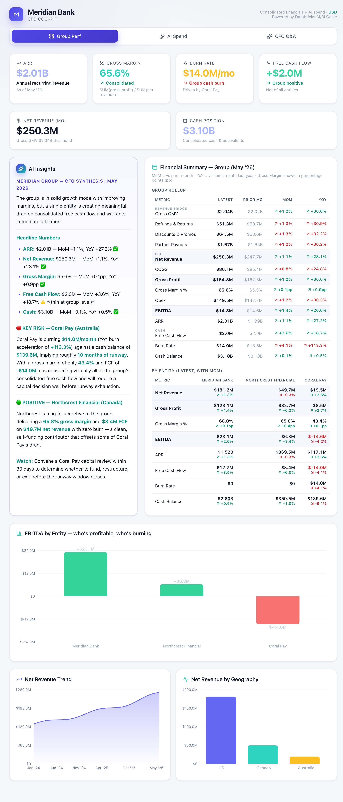
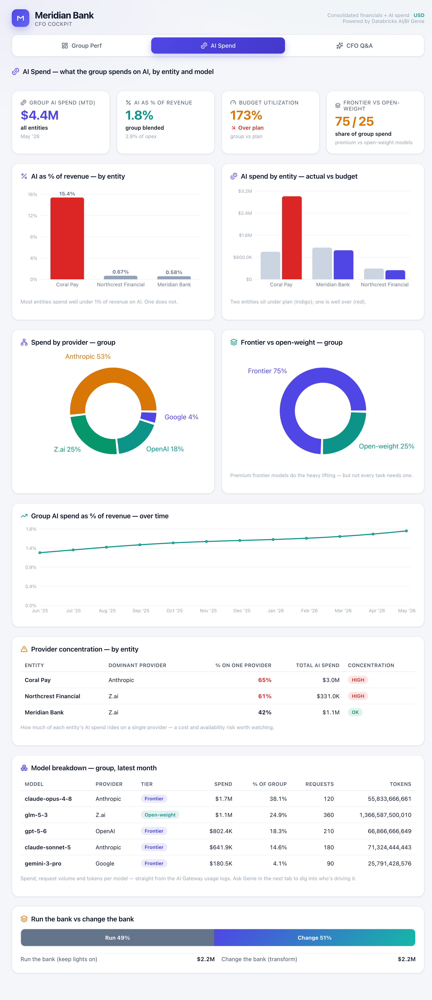
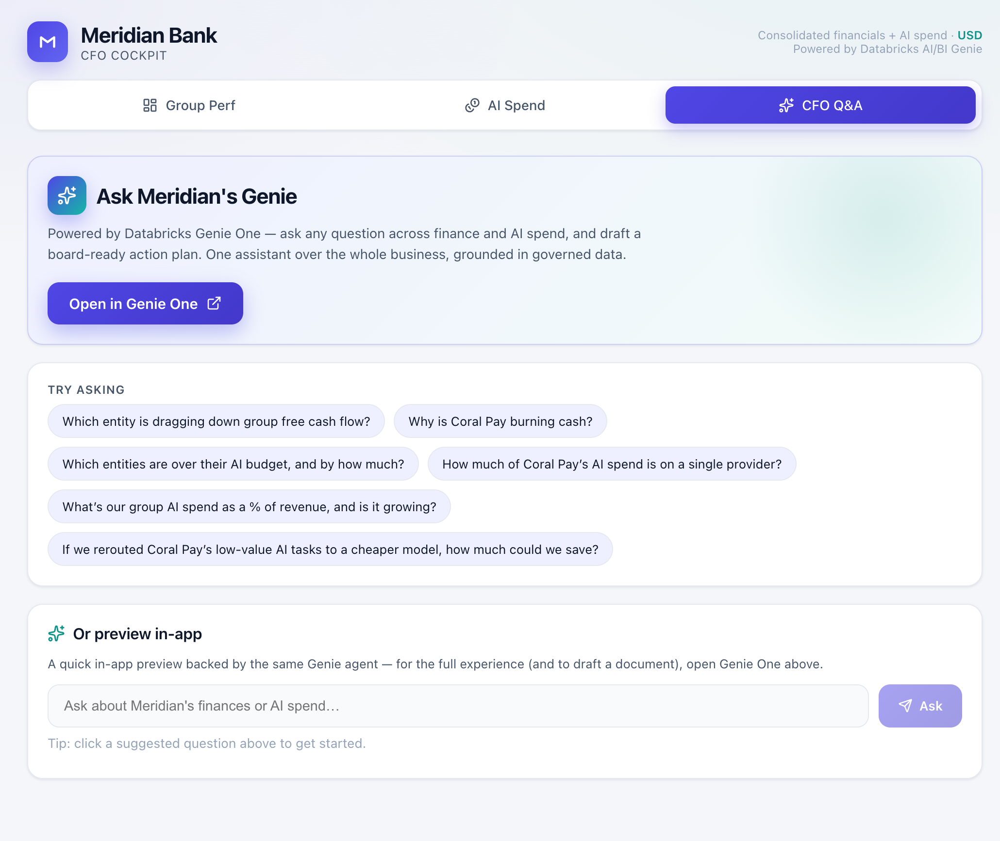

# Meridian AI Cockpit

A **Databricks App** that shows how a CFO's team can explore governed data in plain
English with **Databricks AI/BI Genie** — and put their **AI spend** on the same
footing as the rest of the P&L. Built around a fictional digital‑banking group,
**Meridian Bank**, and its two recently‑acquired subsidiaries.

> **Demo / synthetic data.** Meridian Bank and every figure here are fictional and
> generated by the setup notebook. Nothing in this repo is real financial data.

---

## 📖 The story this demo tells

Meridian Bank is a digital‑banking group with three entities:

| Entity | Geography | Role in the story |
|--------|-----------|-------------------|
| **Meridian Bank** | 🇺🇸 US | The profitable parent — healthy margins, strong cash. |
| **Northcrest Financial** | 🇨🇦 Canada | A clean, margin‑accretive acquisition. The "good" subsidiary. |
| **Coral Pay** | 🇦🇺 Australia | The **problem child** — high growth but burning cash, ~10 months of runway. |

At the group level everything looks great: ARR and revenue growing strongly, healthy
gross margin, group free cash flow positive. **But one entity is quietly draining it.**

The twist — and the reason this resonates with a modern CFO — is that **Coral Pay is
losing money in *two* places at once, and they rhyme:**

1. **Cash:** it's burning ~$14M/month and consuming nearly all of the group's free cash flow.
2. **AI:** it's running **well over its AI budget**, with **~two‑thirds of its AI spend
   concentrated on a single premium model provider** — its data‑science team leaning on a
   frontier model for work a cheaper model could do.

Same lack of discipline, showing up in the financials *and* in AI spend. And the hero
that lets a CFO see all of it — and act — is **Genie**: one natural‑language assistant
over the whole business, finance and AI cost together, grounded in governed Unity Catalog
data with the SQL shown for every answer.

---

## ▶️ Run the demo (≈5‑minute walkthrough)

Present the three tabs left‑to‑right — the story builds as you go.

**1. Group Perf — "everything looks fine… mostly."**
Open on the KPI row: ARR, gross margin, revenue all healthy. Then point to the
**AI Insights** panel — a Genie/Claude‑generated executive synthesis that has already
read the group's numbers and flagged **Coral Pay** as the risk. Scroll to the
**EBITDA‑by‑entity** chart: Meridian and Northcrest are green, **Coral Pay is deep red**.
*Takeaway: the group is growing, but one entity is bleeding.*

**2. AI Spend — "and it's bleeding on AI too."**
The KPI row shows group AI spend, **AI as % of revenue**, budget utilization, and the
frontier‑vs‑open‑weight mix. Then the punchlines:
- **AI as % of revenue by entity** — every entity is under ~1%… except Coral Pay, which towers over the rest.
- **AI spend vs budget** — two entities sit under plan (indigo); **Coral Pay is well over (red).**
- **Provider concentration** — Coral Pay is flagged **HIGH**: most of its spend rides on a single provider.
*Takeaway: the same entity that's burning cash is also the one with undisciplined, concentrated AI spend — and that's a lever you can pull this quarter.*

**3. CFO Q&A — "let Genie connect the dots."**
This is the hero moment. Use the suggested questions to drill from symptom to root cause,
in plain English, live:
1. *"Which entity is dragging down group free cash flow?"* → Coral Pay
2. *"Why is Coral Pay burning cash?"* → the margin/EBITDA breakdown
3. *"Which entities are over their AI budget, and by how much?"* → Coral Pay, well over
4. *"How much of Coral Pay's AI spend is on a single provider?"* → the concentration risk
5. *"What's our group AI spend as a % of revenue, and is it growing?"* → the trend

Each answer shows the **generated SQL** and a chart/table — proof it's grounded, not made up.
Then click **Open in Genie One** to take the same assistant into the full Genie One
experience and **draft a board‑ready action plan** from the conversation.

> **Tip:** frame any "what should we do?" prompt constructively — e.g. *"draft a plan to
> bring Coral Pay's AI spend under control via smart routing and provider diversification."*

---

## 🖥️ The app (3 tabs)

| Tab | What it shows |
|-----|---------------|
| **Group Perf** | Group KPIs, a revenue‑bridge breakdown and financial summary, ARR/margin trends, EBITDA‑by‑entity and geography charts, and an AI‑generated executive synthesis grounded in the real numbers. |
| **AI Spend** | AI cost by entity, provider, team, and model; budget utilization; AI as a % of revenue; frontier‑vs‑open‑weight mix; and single‑provider concentration risk. |
| **CFO Q&A** | Natural‑language questions answered by a **Databricks Genie** space over the Unity Catalog tables (with visible SQL), plus an **Open in Genie One** launchpad for the full assistant experience. |

## 📸 Screenshots





---

## 🏗️ Architecture

```
FastAPI (app.py)
  ├─ /api/kpis, /api/trends, /api/summary, ...  → server/data_routes.py      → SQL Warehouse
  ├─ /api/ai/overview, /api/ai/providers, ...   → server/ai_routes.py        → SQL Warehouse
  ├─ /api/genie/ask                             → server/genie_routes.py     → Genie Space API
  ├─ /api/synthesis                             → server/synthesis_routes.py → Foundation Model
  └─ /* (SPA)                                   → frontend/dist/             → React build
```

React + Vite + TypeScript frontend, FastAPI backend, Unity Catalog gold tables as the
data layer, a Genie space for NL Q&A, and a Foundation Model endpoint for the synthesis.

## ✅ Prerequisites

- A Databricks workspace with **Unity Catalog** enabled
- A **Serverless (or Pro) SQL Warehouse**
- A **Foundation Model** endpoint (default: `databricks-claude-sonnet-4-6`)
- **Databricks CLI** configured (`databricks auth login`)
- **Node.js 18+** and **Python 3.11+**

## 🚀 Setup

**1. Clone**
```bash
git clone https://github.com/29sonakshi/meridian-ai-cockpit.git
cd meridian-ai-cockpit
```

**2. Create the sample data** — import `setup/01_generate_sample_data.py` as a notebook,
set the **catalog** / schema widgets (defaults `meridian_demo` / `meridian_cfo` /
`meridian_ai`), and **Run All**. Creates 8 Unity Catalog tables:
- `<catalog>.meridian_cfo`: `dim_entity`, `fact_financials_monthly`, `fact_cash_monthly`, `fact_revenue_bridge_monthly`
- `<catalog>.meridian_ai`: `fact_ai_spend_monthly`, `fact_ai_spend_by_provider`, `fact_ai_spend_by_team`, `fact_ai_spend_detail`

**3. Create the Genie space** — import `setup/02_create_genie_space.py`, set the
**catalog** and **warehouse_id** widgets, **Run All**, and note the **Space ID** it prints.

**4. Configure** — for a deployed app, set `WAREHOUSE_ID`, `GENIE_SPACE_ID`, and
`UC_CATALOG` in `app.yaml`. For local dev, copy `.env.example` → `.env` and fill the same
values (auth uses your Databricks CLI profile — no tokens are stored in the repo).

**5. Build the frontend**
```bash
cd frontend
cp .env.example .env      # set VITE_GENIE_ONE_URL to https://<your-workspace-host>/one
npm install
npm run build             # outputs frontend/dist/, served by FastAPI
cd ..
```
> `frontend/dist/` is **not** committed — you build it here. `VITE_GENIE_ONE_URL` is baked
> into the build so the **Open in Genie One** button points at your workspace (hidden if unset).

**6. Run or deploy**
```bash
# Local
pip install -r requirements.txt
set -a && source .env && set +a
uvicorn app:app --reload --port 8000        # → http://localhost:8000

# Databricks App
databricks apps create meridian-ai-cockpit
databricks sync . /Workspace/Users/<you>/meridian-ai-cockpit
databricks apps deploy meridian-ai-cockpit --source-code-path /Workspace/Users/<you>/meridian-ai-cockpit
```
After deploy, grant the app's service principal `SELECT` on both schemas, `CAN_USE` on the
SQL warehouse, and `CAN_RUN` on the Genie space.

## 📁 Project layout

```
app.py                 FastAPI entry point (API + serves the built SPA)
app.yaml               Databricks App config — set your workspace values here
requirements.txt       Python dependencies
server/                Backend: data_routes, ai_routes, genie_routes, synthesis_routes,
                       plus config.py (env-driven), sqlexec.py, llm.py
frontend/src/          React + Vite + TypeScript
  ├─ App.tsx             shell + 3-tab nav
  ├─ tabs/               GroupPerf · AiSpend · Genie
  ├─ components/         FinancialSummary, Synthesizer, shared ui
  └─ lib/                API client + formatters
setup/                 Databricks notebooks: 01 sample data · 02 Genie space
docs/                  README screenshots
.env.example           Local-dev config template
```

## License

Apache 2.0 — see [LICENSE](LICENSE).
